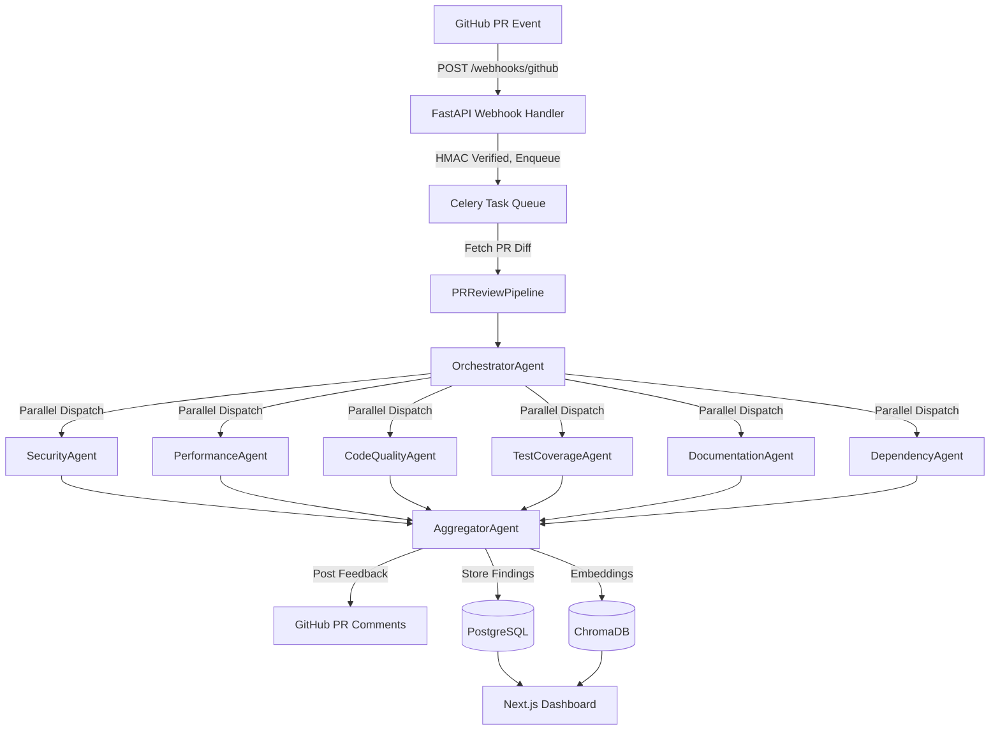

<div align="center">
  
  
  
  
  
  

  <h1>🛡️ AgentScope PR Sentinel</h1>
  <p><strong>Enterprise-Grade Multi-Agent Pull Request Intelligence Platform</strong></p>
</div>

<br />

AgentScope PR Sentinel automates and supercharges code review using a fleet of specialized AI agents. It integrates directly with GitHub via webhooks, analyzes pull requests across multiple domains (Security, Performance, Quality, Testing, Documentation, Dependency), and posts synthesized findings directly to the PR while offering a comprehensive Next.js dashboard for engineering teams.

## ✨ Features

- **Multi-Agent Orchestration**: Powered by [AgentScope](https://github.com/modelscope/agentscope), coordinating 7 distinct LLM-driven agents.
- **Deep Domain Analysis**: Specialized agents for Security (OWASP Top 10), Performance, Code Quality, Test Coverage, Documentation, and Dependency Risks.
- **Enterprise-Ready Backend**: Async FastAPI + SQLAlchemy 2.0 with Celery for background processing.
- **Smart Deduplication**: Vector-based finding deduplication using ChromaDB and Sentence Transformers.
- **Real-Time Dashboard**: Next.js 14 App Router frontend featuring live WebSocket updates of agent progress.
- **Observability**: Built-in LangFuse LLM tracing and Prometheus + Grafana metrics.

## 🏗️ Architecture



## 🚀 Quick Start (Development)

### Prerequisites
- Docker and Docker Compose
- Python 3.11+
- Node.js 20+

### Setup

1. **Clone the repository**
   ```bash
   git clone https://github.com/Paramveersingh-S/Agentscope-PR.git
   cd Agentscope-PR
   ```

2. **Environment Configuration**
   Copy the example environment file and fill in your keys (Groq API, GitHub App, etc.):
   ```bash
   cp .env.example .env
   ```

3. **Start the Infrastructure**
   Launch PostgreSQL (pgvector), Redis, and ChromaDB:
   ```bash
   docker compose up -d postgres redis chromadb
   ```

4. **Initialize the Backend**
   ```bash
   cd backend
   python -m venv venv
   source venv/bin/activate  # On Windows: venv\Scripts\activate
   pip install -r requirements.txt
   alembic upgrade head
   ```

## 🛠️ Tech Stack Details

### Backend
- **Python 3.11+**
- **AgentScope 0.1.x** for core multi-agent orchestration
- **FastAPI** for REST endpoints and WebSockets
- **SQLAlchemy 2.0** (Asyncpg) + **Alembic**
- **Celery 5.3+** + Redis as broker

### Frontend
- **Next.js 14** (App Router)
- **TypeScript 5.x**
- **TailwindCSS** + **shadcn/ui**
- **Tanstack Query v5** + **Zustand 4.x**
- **Recharts** for analytics visualization

### LLM Backends
- **Groq API** (Recommended, Free tier available)
- **Ollama** (Local models)
- **Together AI**

## 🤝 Contributing
1. Fork the repository
2. Create your feature branch (`git checkout -b feature/amazing-feature`)
3. Commit your changes (`git commit -m 'feat: add amazing feature'`)
4. Push to the branch (`git push origin feature/amazing-feature`)
5. Open a Pull Request

## 📄 License
This project is licensed under the MIT License.
